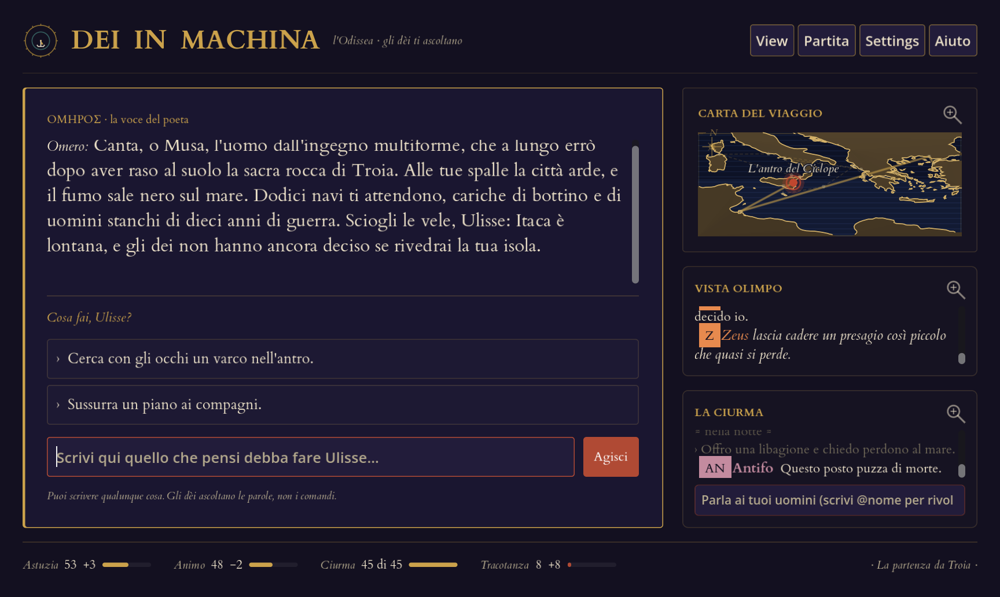
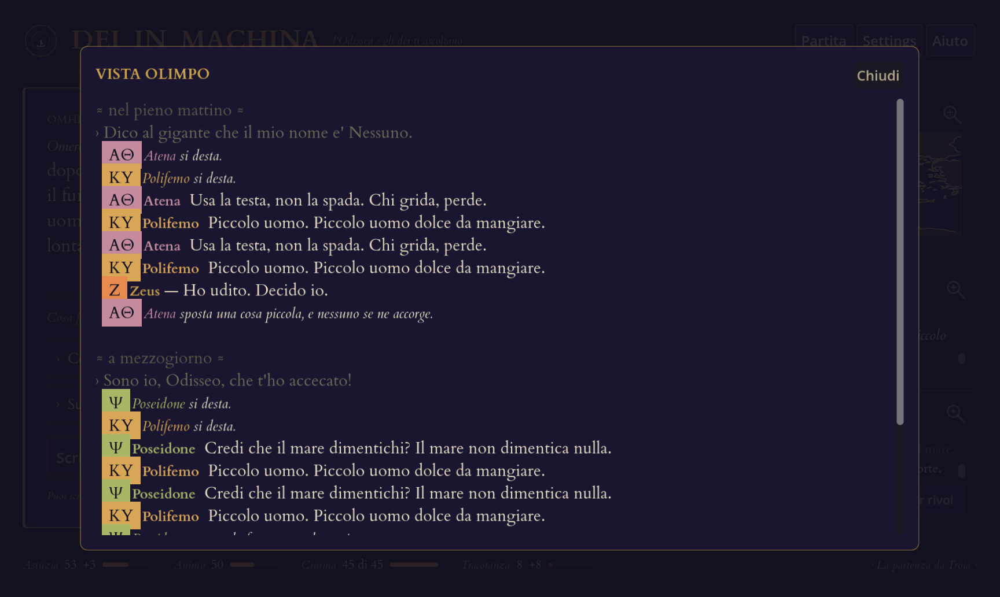
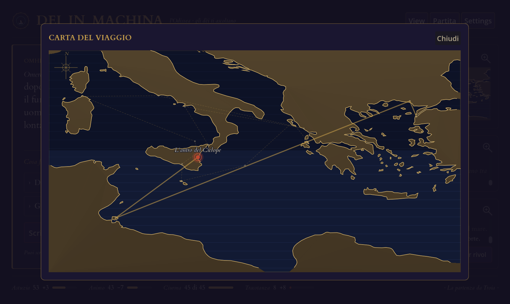

# Dei in machina

> *«Canta, o Musa, l'uomo dall'ingegno multiforme…»*

**Tu sei Ulisse. Gli dèi sono agenti che non vedrai mai.**

Scrivi in italiano quello che vuoi fare — non scegli da un menù, non impari comandi. Omero
racconta cosa succede. Ma Omero è reticente: ti dice che il mare si è alzato, mai *chi* l'ha
alzato. Sopra la tua testa, in una stanza che non puoi vedere, tredici divinità con agende
inconciliabili discutono cosa farti. Atena ti protegge finché sei astuto. Poseidone dorme —
e continuerà a dormire, qualunque cosa tu faccia, finché non griderai il tuo nome a suo
figlio. Zeus arbitra, quando c'è da arbitrare.

Il gioco vero non è arrivare a Itaca. È capire **chi hai svegliato, e come**.



---

## Un turno, dall'inizio alla fine

Sei nell'antro del Ciclope. L'hai accecato, e state scappando. Scrivi:

> *Grido al ciclope il mio vero nome: sono io, Odisseo!*

Ecco cosa succede, nell'ordine.

**1 · La frase viene letta e classificata.** Un modello linguistico la riduce a poche
etichette di un elenco chiuso — qui `vanto` e `tracotanza`, ad alta intensità. È un
giudizio, e potrebbe darne uno diverso: è l'unico punto in cui la libertà di come scrivi
entra nel meccanismo.

**2 · Da qui comandano le regole.** Nella tappa del Ciclope un `vanto` fa accadere un fatto
preciso: *la maledizione di Polifemo*. E quel fatto è ciò che desta Poseidone, che fino a
un istante prima **dormiva** e non poteva reagire a nulla — nemmeno all'accecamento di suo
figlio. Nessun modello ha voce in capitolo: è una riga di dati.

**3 · Gli dèi svegli discutono, e qui non comanda nessuno.** Poseidone dice quello che gli
pare, in carattere. Se c'è anche Atena, si ribattono. Ognuno propone *come* agire scegliendo
fra i modi che gli appartengono — castigo, aiuto, segno, trappola — e con quanta forza.

**4 · La conseguenza torna a essere una regola.** «Castigo, intensità 2» vale sempre lo
stesso: quattro punti di animo in meno, quattro di ira in più, e un compagno che non torna.
Il modello sceglie *cosa* fare; quanto pesa è deciso altrove.

**5 · Omero racconta.** Senza nominare nessuno. Leggi che il mare si è fatto nero e che un
uomo è caduto in acqua. Chi sia stato, lo devi capire tu.

---

## Regole fisse, voci che non si ripetono

Due partite con le stesse mosse non raccontano la stessa storia: a leggere la tua frase c'è
un modello, a risponderti ce n'è un altro, e nessuno dei due si ripete. Ma il **nesso fra
causa ed effetto** è scritto, e non cambia mai.

| Scritto nelle regole — uguale ogni volta | Deciso da un modello — mai due volte uguale |
|---|---|
| Quali fatti svegliano quale dio, e chi sta ancora dormendo | Come la tua frase viene interpretata |
| Quanto pesa una certa reazione a una certa intensità | Se punirti, aiutarti o ignorarti — e con che voce |
| Quando la tappa avanza, e chi muore alla sua tappa | Cosa si dicono gli dèi fra loro |
| Cosa non ti verrà mai proposto come appiglio | Come Omero racconta ciò che è successo |

Questa divisione è il gioco. Se fosse un modello a decidere chi si sveglia, non ci sarebbe
niente da dedurre: la stessa mossa darebbe esiti diversi per capriccio, e resterebbe un
generatore di eventi con un bel lessico. Le regole rendono il mondo **leggibile**; i modelli
gli danno una voce che non si esaurisce.

---

## La stanza degli dèi

C'è una finestra sul concilio. Tu la vedi, Ulisse no.



Gli dèi si destano, parlano, si ribattono, e alla fine **uno agisce**. Chi la spunta non
viene annunciato da nessuna scritta: si capisce perché è l'unico che muove la mano. Se
qualcuno vuole punirti mentre un altro vuole aiutarti, interviene Zeus e chiude con parole
sue.

È una finestra di servizio, non una scorciatoia: quello che leggi lì Ulisse non lo sa, e la
narrazione continua a non nominare nessuno. Puoi anche tenerla chiusa e giocare al buio.

## Quindici tappe, da Troia a Itaca



Ogni capitolo ha la **sua musica**, in strumenti dell'epoca — lira, kithara, aulos doppio,
tamburo a cornice — e costruita per girare in anello senza cuciture: nessuna cadenza finale,
nessuna dissolvenza, perché un brano di sottofondo non sa quanto durerà la scena. Aggiungerne
uno è posare un file in `music/` col nome del capitolo, `ciclope.mp3`: nessuna importazione,
nessuna configurazione. I prompt che li hanno generati sono
[nel repository](music/README.md) — la partitura si legge e si riesegue.

Le coste sono vere (dati Natural Earth, ridisegnati); la rotta è quella del poema. I
compagni hanno un nome e un carattere, e **si può parlare con loro** — costa poco e non fa
girare il mondo, ma quello che dici a bordo lo sentono anche gli dèi, al turno dopo. Chi
deve morire muore alla sua tappa, come sta scritto: e da quel momento la sua voce sparisce
dalla conversazione.

---

## Tre garanzie

**Gli dèi restano nascosti.** La narrazione non nomina mai una divinità — nemmeno per
allusione trasparente, nemmeno quando il modello sarebbe tentato. È verificato a ogni
esecuzione dei test, non affidato alla buona volontà.

**Quello che il gioco ti propone, il gioco lo accetta.** I tre appigli sotto la narrazione
sono un impegno: nessuno di essi può essere rifiutato come «gesto che non appartiene a
questo mondo», e nessuno ti offrirà di aprire l'otre dei venti prima che Eolo te l'abbia
dato.

**La spesa è dichiarata, non scoperta a fine mese.** Una partita intera, da Troia a Itaca,
sono circa **450 chiamate e 1,03 milioni di token**, quasi tutti in *ingresso*: il costo di
un gioco così è il contesto che si rilegge a ogni turno, non le parole che genera. Con
Ollama paghi in tempo invece che in denaro. Un *profilo di costo*, dal Frugale in su,
decide quante voci parlano per turno. È una **stima**, non un tetto imposto dal gioco: cosa
significa, e cosa non copre, sta in [Stato del collaudo](#stato-del-collaudo).

---

## Requisiti

### Software

| | |
|---|---|
| **Sistema** | Linux x86_64 · macOS (Intel o Apple Silicon) |
| **Motore** | Godot **4.7.x** — non serve installarlo: `avvia.sh` lo scarica al primo avvio (~138 MB) e **ne verifica l'impronta SHA-512** prima di eseguirlo |
| **Nel sistema** | `bash`, `curl`, `unzip`, `sha512sum` (o `shasum`) — già presenti su Linux e macOS |
| **Per il Gateway** (facoltativo) | `python3` ≥ 3.9, nessuna libreria esterna |
| **Spazio** | ~13 MB il progetto, ~138 MB Godot, più i modelli se usi Ollama |

Windows non è supportato dal launcher. Il progetto è Godot puro e si apre anche con un
Godot 4.7 installato a mano, ma è una configurazione non collaudata.

### Chi dà voce agli dèi

Serve **un** motore linguistico, a scelta tua. Il gioco non ne include nessuno.

**Sul tuo computer — Ollama.** Nessuna chiave, nessun costo, nessun dato che esce di casa.
Il gioco è tarato su **Mistral Small 3.2 (24 B)**: è il modello su cui gli otto prompt sono
stati scritti e misurati.

| Se hai… | Cosa aspettarti |
|---|---|
| **≥ 16 GB di VRAM** | Mistral Small 3.2 gira sulla scheda: fluido |
| **8–12 GB di VRAM** | Un modello da 7–8 B quantizzato va bene; il 24 B parte, ma lento |
| **Solo RAM (≥ 16 GB)** | Funziona, ma un turno può richiedere minuti |
| **< 8 GB in tutto** | Meglio un servizio in rete |

Non devi indovinare: in *Impostazioni* ogni modello che hai installato ha un **verdetto**
accanto — ✓ ci gira · ? ci gira ma lento · ✗ non ci sta — calcolato sulla memoria vera della
tua macchina, con la ragione nel tooltip.

**In rete — Mistral, Google, OpenAI, Anthropic, OpenRouter.** Serve una chiave tua. Si
inserisce in *Impostazioni* e finisce nella cartella dati dell'utente: **mai nel progetto,
mai in un commit**. Una variabile d'ambiente ha la precedenza, se preferisci non scriverla
da nessuna parte.

| Provider | Collaudato davvero |
|---|---|
| Ollama · Mistral · Google | **sì** — partite vere, non solo test |
| OpenAI | profilo presente, mai provato contro il servizio |
| Anthropic · OpenRouter | profilo presente, **mai provato** contro il servizio vero |

I profili non collaudati sono scritti secondo la documentazione del provider, non secondo
una risposta vista arrivare. Se ne provi uno e funziona — o non funziona — dirlo è il modo
più utile di contribuire.

### La chiave di Mistral, passo per passo

È il servizio in rete su cui il gioco è tarato, e il suo piano gratuito basta per giocare.

1. Registrati su **[console.mistral.ai](https://console.mistral.ai)**.
2. Attiva il piano gratuito. Mistral chiede la **verifica del numero di telefono**: finché
   non la fai, la chiave esiste ma ogni chiamata torna un errore di autorizzazione — ed è un
   errore che sembra una chiave sbagliata.
3. **API Keys → Create new key.** Il valore si vede **una volta sola**: copialo subito.
4. Dàlla al gioco in uno dei due modi:
   - *Impostazioni* → provider **Mistral** → incolla nel campo. Finisce in
     `user://impostazioni.json`, fuori dal progetto e fuori da git.
   - Oppure `export MISTRAL_API_KEY=...` prima di avviare. Ha la precedenza sul campo, e se
     usi il Gateway è **l'unica** strada che funziona.
5. **Aggiorna elenco** → scegli `mistral-small-latest` → **Prova il modello**. Quel pulsante
   fa una generazione vera: è l'unico modo di sapere che la catena regge tutta.

Le stesse cose valgono per Google (`GEMINI_API_KEY`, chiave da
[aistudio.google.com](https://aistudio.google.com/apikey)).

### Il Gateway: come restare dentro il piano gratuito

Sui piani gratuiti il collo di bottiglia non è il volume, sono le **richieste al secondo**.
Un turno pieno ne fa fino a nove, quasi insieme: senza freno, la maggior parte torna `429`.

`llm_gateway/` è un processo Python separato — stdlib, nessuna dipendenza — che parla il
protocollo OpenAI e sta **davanti** al provider. Il gioco lo usa cambiando solo l'indirizzo:
tutta la logica del piano gratuito vive lì, e per toglierla si spegne il processo.

Per ogni richiesta, in quest'ordine:

1. **Cache** — payload identico chiesto di recente → risposta immediata, **zero quota**
   (un'ora di validità, 500 voci).
2. **Coda** — una FIFO per provider, un solo worker: mai due richieste in volo verso lo
   stesso servizio.
3. **Freno** — tre vincoli insieme: distanza minima fra due richieste (il limite di
   *velocità*), tetto al minuto, tetto al giorno.
4. **Ritentativo** — su `429` o `5xx` riprova con attesa che raddoppia (1s, 2s, 4s…),
   obbedendo all'header `Retry-After` quando il provider lo manda.

I limiti sono in `llm_gateway/limiti.json`, **prudenziali** di proposito: le finestre del
provider non coincidono al millisecondo con le nostre.

| Provider | Distanza minima | Al minuto | Al giorno |
|---|---|---|---|
| `mistral` | 1,1 s | 28 | — |
| `google` | 4,2 s | 14 | 1400 |
| `openrouter` | 3,1 s | 18 | **50** |
| `anthropic` | 1,4 s | 45 | — |
| `openai` · `ollama` | nessun freno | | |

Quel **50** è una trappola dichiarata: i modelli OpenRouter col suffisso `:free` hanno un
tetto giornaliero *per account*, e una partita intera chiede ~450 chiamate. Non ci sta. Il
Gateway lo scrive nel log all'avvio invece di fartelo scoprire a metà viaggio. Anthropic non
ha un piano gratuito affatto, e anche questo viene detto all'avvio.

**E non ripiega mai su un altro provider.** Se gliene chiedi uno che non conosce, risponde
con un errore che dice quali ha e dove aggiungerlo. Prima ripiegava sul predefinito, e una
configurazione mancante diventava la risposta di un altro modello: `prova_instradamento.py`
tiene ferma la regola con otto scenari e provider finti.

```bash
export MISTRAL_API_KEY=...        # le chiavi le tiene il Gateway, non il gioco
cd llm_gateway && ./gateway.sh start
```

Poi in *Impostazioni* spunta il **Gateway**. È un *trasporto*, non un provider: si combina
con il modello che hai già scelto.

Una cosa da sapere. Il Gateway legge le chiavi **dal proprio ambiente**: quella scritta in
*Impostazioni* non gli arriva, e senza `export` ogni richiesta torna `401` sembrando un
guasto del gioco (il log lo dice: `CHIAVE MANCANTE`).

Ascolta **solo su `127.0.0.1`**, non ha autenticazione e non deve averne: non va esposto in
rete. Dettagli in **[llm_gateway/README.md](llm_gateway/README.md)**.

---

## Stato del collaudo

Detto chiaramente, perché stai per collegarci una chiave a pagamento.

**Cos'è verificato.** 435 test automatici su 44 script, eseguiti a ogni modifica, più sei
turni campione registrati come riferimento e confrontati voce per voce. Coprono la macchina
deterministica — risvegli, delta, avanzamento delle tappe, interfaccia — con un motore
simulato al posto dei modelli.

**Cosa non è verificato.** Il gioco **non ha alle spalle un collaudo umano esteso**: non è
stato giocato molte volte, da molte persone, con modelli reali. I test di sistema dicono che
la macchina fa quello che deve; non dicono che una partita di settantasei turni con un
modello vero non incontri niente di storto. Le integrazioni provate contro il servizio
reale sono **Ollama, Mistral e Google**; **Anthropic e OpenRouter no**.

**Nessuna garanzia.** Il software è fornito «così com'è», senza garanzie di alcun tipo,
come previsto dalle sezioni 15 e 16 della licenza AGPL-3.0. Chi lo pubblica **non risponde**
di malfunzionamenti, perdita di dati o partite, né di **costi verso i provider LLM** —
compresi consumi imprevisti o eccessivi dovuti a un difetto del software, a un ciclo di
richieste che non si ferma o a una configurazione sbagliata.

La chiave è tua, il piano è tuo, la spesa è tua: **tieni d'occhio il consumo** sulla console
del provider e imposta un tetto di spesa dove il provider lo permette. Se questa parte ti
preoccupa, gioca con **Ollama**: nessuna chiave, nessuna fattura possibile.

---

## Comincia

```bash
git clone <questo repo> dei_in_machina
cd dei_in_machina
./avvia.sh
```

È tutto. Il launcher riconosce il sistema, scarica il Godot giusto, ne verifica l'impronta,
importa le risorse e apre il gioco. Al primo avvio ci mette un minuto; dopo, subito.

```bash
./avvia.sh test          # la suite: 435 test, 44 script
./avvia.sh installa-menu # (Linux) mette il gioco nel menu applicazioni
```

Guida completa, Ollama compreso: **[COME_GIOCARE.md](COME_GIOCARE.md)**.

---

## Sotto il cofano

Otto **agenti**: otto ruoli distinti, ognuno con un suo prompt in un file separato, una sua
risposta attesa e un ripiego che non manda mai in pezzi il turno se il modello sbaglia.

| | |
|---|---|
| **Interprete** | traduce il tuo testo libero in etichette di un elenco chiuso |
| **Dio-agente** | uno per ogni dio sveglio: sceglie come reagire, e cosa dire |
| **Arbitro** (Zeus) | interviene solo quando gli dèi si contraddicono |
| **Narratore** (Omero) | racconta il turno, e non nomina nessuno |
| **Suggeritore** | i tre appigli, quando Omero non li ha già dati |
| **Cronista** | tiene un riassunto rotolante della vicenda, per non rileggere tutto |
| **Compagno** | la voce di un membro della ciurma |
| **Ricognitore** | capisce a *chi* stai pregando, quando preghi per allusione |

Il codice attorno agli agenti è **verificabile senza modelli accesi**. Un motore simulato
risponde al posto loro — senza rete, senza token, senza attesa — e con esso l'intera
macchina del turno diventa ripetibile: è ciò che rende possibili **435 test** per un gioco
fatto di LLM. Sei turni campione a seme fisso restano registrati come riferimento, e ogni
modifica viene confrontata con essi voce per voce.

In `tools/` ci sono gli strumenti per guardarci dentro: stampare la traccia completa di una
partita, stimare il costo costruendo i messaggi veri prima di spenderli, controllare che i
nomi dei modelli dichiarati esistano davvero nei cataloghi dei provider, fotografare
l'interfaccia.

### I documenti

| | |
|---|---|
| [docs/dei_in_machina_design.md](docs/dei_in_machina_design.md) | il **perché** — il design, congelato |
| [docs/architettura_dettaglio.md](docs/architettura_dettaglio.md) | il **come** — componenti, agenti, i tre cancelli del risveglio, il budget delle chiamate |
| [docs/contratto_interprete.md](docs/contratto_interprete.md) | l'elenco chiuso delle etichette |
| [docs/guardrail_anti_assistente.md](docs/guardrail_anti_assistente.md) | il blocco incluso nel prompt di *ogni* agente |
| [docs/costi.md](docs/costi.md) | quanto costa una partita, voce per voce |
| [music/README.md](music/README.md) | la colonna sonora: com'è fatta, e come aggiungerne |

---

## Privacy e sicurezza

- **Nessuna telemetria.** Il gioco non manda niente a nessuno, tranne al motore che *tu* hai
  scelto.
- **Con Ollama non esce nulla dal tuo computer.**
- Le chiavi API stanno in `user://impostazioni.json` (cartella dati dell'utente), in chiaro
  come qualunque file di configurazione: fuori dal progetto, fuori dai commit. Né il gioco
  né il Gateway stampano mai il **valore** di una chiave, solo se c'è.
- Il testo che arriva da un modello non può alterare l'interfaccia: viene reso inerte
  appena entra.

Dettagli, e cosa **non** c'è: **[SECURITY.md](SECURITY.md)**.

---

## Licenza

**GNU AGPL-3.0** — vedi [LICENSE](LICENSE). In breve: puoi usarlo, studiarlo, modificarlo e
ridistribuirlo; se ne pubblichi una versione modificata, o la offri come servizio in rete,
devi pubblicarne il codice con la stessa licenza.

Componenti di terzi (GUT, il carattere Cardo, Godot): **[TERZE_PARTI.md](TERZE_PARTI.md)**.

---

<details>
<summary><b>In English</b></summary>

**You are Odysseus. The gods are agents you will never see.**

*Dei in machina* is a narrative game about the *Odyssey*, in Italian, built in Godot 4. You
type what you want to do in plain prose; Homer narrates the consequences — and Homer is
reticent: he tells you the sea rose, never *who* raised it. Above you, thirteen deities with
irreconcilable agendas argue about what to do with you. The real game is deducing **which
powers you woke, and how**.

**How a turn works.** A language model reads your sentence and reduces it to a few labels
from a closed vocabulary — that step is a judgement, and it is the only place your freedom
of phrasing enters the machine. From there, written rules take over: which facts wake which
god, who is still asleep, how much a given reaction costs you, when the voyage advances.
The gods then argue in their own voices, one prevails, and the numbers that follow are
fixed. Homer narrates, naming no one.

So it is **not** deterministic — two playthroughs of the same moves won't tell the same
story. What is fixed is the *link between cause and effect*, and that's the point: if a
model decided who wakes, there would be nothing to deduce. Rules make the world legible;
models give it a voice that never repeats. (With the models switched off and a fixed seed
the whole turn machine *is* reproducible — that's how 435 tests exist for a game made of
LLMs.)

Runs on Linux and macOS. Bring your own model: Ollama locally (nothing leaves your machine)
or any of Mistral / Google / OpenAI / Anthropic / OpenRouter. Start with `./avvia.sh`.

**Testing status.** Verification rests on 435 automated tests against a simulated engine,
**not** on extended human playtesting. Only the **Ollama, Mistral and Google** integrations
have been exercised against the real services; **Anthropic and OpenRouter have not**. The
local gateway routes all of them, and never silently falls back to a different provider.
The software comes with **no warranty
of any kind** (AGPL-3.0, §15–16): no liability is accepted for malfunctions, lost data, or
**LLM provider costs**, including unexpected or excessive spend caused by a defect or a
misconfiguration. Your key, your plan, your bill — watch your usage and set a spending cap.
Or play with Ollama, where no bill is possible.

Licensed under the GNU AGPL-3.0. The game and its documentation are in Italian.

</details>
