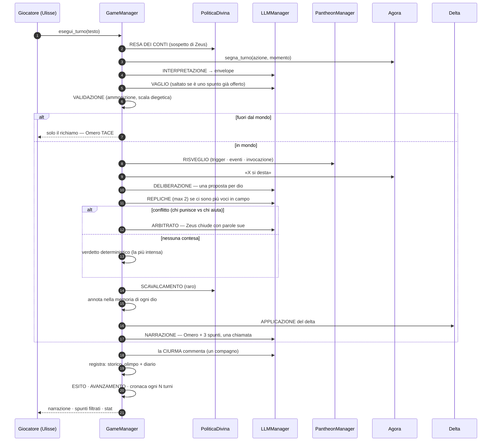
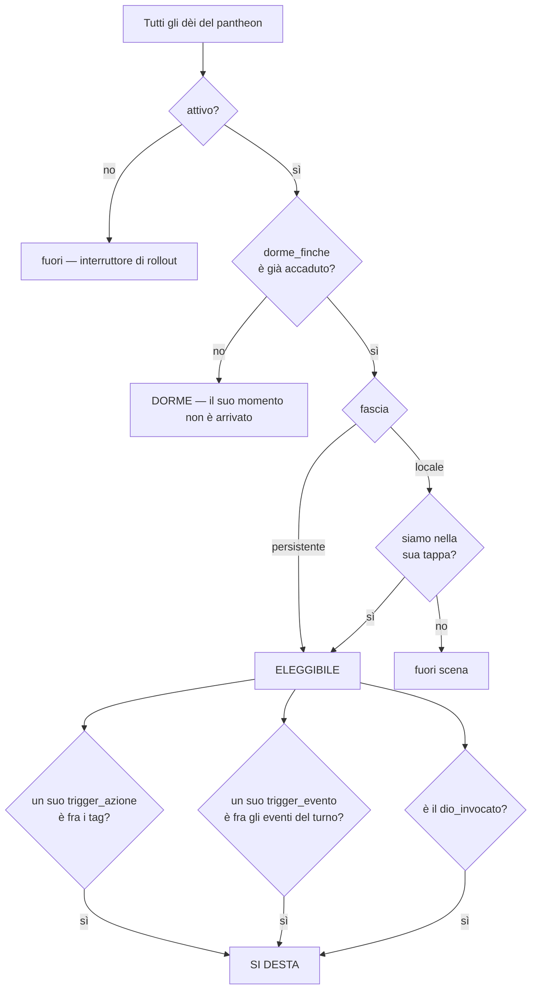
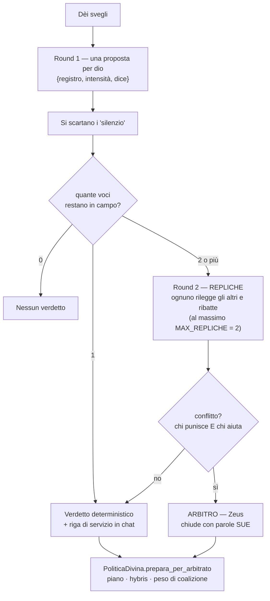
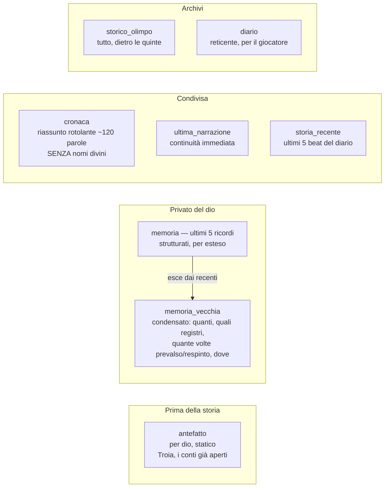
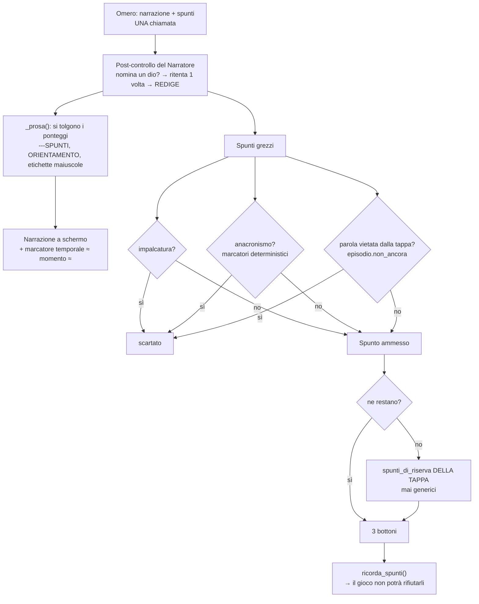
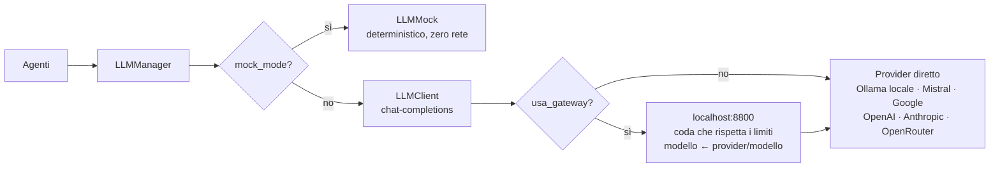

# Architettura di dettaglio — Dei in machina

*Aggiornato a v2.34 · 425 test verdi (43 script)*

Questo documento descrive **come funziona davvero il gioco che gira**: quali componenti
esistono, chi chiama chi, come gli dèi e i compagni vengono attivati, e come si forma la
risposta che il giocatore legge.

Rapporto con gli altri documenti:

| Documento | Cosa dice |
|---|---|
| `dei_in_machina_design.md` | Il **perché**: pilastri, pantheon, esiti. Congelato pre-Godot: comanda sul design, non descrive il codice. |
| `contratto_interprete.md` | Il **vocabolario chiuso** dei tag e lo schema dell'envelope. |
| `guardrail_anti_assistente.md` | Il blocco di prompt condiviso da ogni agente. |
| **questo documento** | Il **come**: componenti reali, interazioni, punti di estensione. |
| `macchina_del_turno.mermaid`, `architettura_odissea.mermaid` | Gli stessi diagrammi, in file separati per chi li vuole aprire da solo. |

---

## 0. La regola che spiega ogni scelta

> **Il prompt è una preghiera, il codice è la garanzia.**

Tutto ciò che segue discende da qui. Un LLM può *quasi sempre* rispettare una richiesta,
e "quasi sempre" in un gioco significa un difetto visibile ogni poche partite. Quindi la
divisione del lavoro è netta e non negoziabile:

| Al codice (GDScript, deterministico) | All'LLM (voce e capriccio) |
|---|---|
| Chi si sveglia (trigger, sonno, eleggibilità) | Come reagisce (registro, intensità, battuta) |
| Quanto cambia il mondo (delta, numeri) | Cosa si dicono gli dèi fra loro |
| Cosa può essere proposto al giocatore (filtri) | Come Omero racconta |
| Quando la tappa avanza | Cosa pensa un compagno |
| Coalizioni, scavalcamenti, resa dei conti | La sintesi/classificazione dell'input |

Ogni volta che sul campo è emerso un difetto di "qualità LLM", la causa vera era un
**presidio deterministico mancante**: gli anacronismi negli spunti (→ `filtra_spunti`),
Poseidone sveglio ai Ciconi (→ `dorme_finche`), Perimede fuori carattere (→ `anti_pattern`),
il gioco che rifiutava i propri suggerimenti (→ `gia_proposto`).

---

## 1. Mappa dei componenti

```mermaid
flowchart TD
    subgraph UI["Interfaccia — Godot (scenes/)"]
        MAIN["main.gd<br/>schermata giocatore · spunti<br/>condizione in fondo · intestazione"]
        FOL["PannelloChat «Olimpo»<br/>nella pagina, sola lettura"]
        FCI["PannelloChat «Ciurma»<br/>nella pagina, INTERATTIVA"]
        LEN["lente.gd<br/>carta e chat, grandi"]
        FLOG["FinestraTesto «Log LLM»<br/>l'unica finestra a se'"]
        FSET["FinestraImpostazioni<br/>motore · provider · modello · gateway"]
        MAP["mappa_viaggio.gd<br/>carta del Mediterraneo"]
        SPL["splash.gd + marchio.gd<br/>emblema d'apertura"]
        MUS["colonna_sonora.gd<br/>un brano per momento"]
    end

    subgraph CORE["Nucleo — Autoload"]
        GM["GameManager<br/>FSM del turno · beat · memoria<br/>spunti · avanzamento tappe"]
        PM["PantheonManager<br/>eleggibilità · RISVEGLIO<br/>risoluzione invocazioni"]
        LM["LLMManager<br/>instradamento agenti<br/>mock ↔ reale · provider · gateway"]
    end

    subgraph REGOLE["Regole estratte (scripts/)"]
        VAL["Validazione<br/>vaglio + ammonizione"]
        POL["PoliticaDivina<br/>coalizioni · piani · scavalcamenti · resa dei conti"]
        DEL["Delta<br/>i NUMERI del mondo"]
        AG["Agora<br/>canali · viste · intestazioni"]
        CIU["Ciurma<br/>compagni vivi e caduti"]
    end

    subgraph AGENTI["Agenti LLM (scripts/llm/)"]
        INT["Interprete"]
        DIO["DioAgente"]
        ARB["Arbitro (Zeus)"]
        NAR["Narratore (Omero)"]
        SUG["Suggeritore"]
        CRO["Cronista"]
        COM["Compagno"]
        CLI["LLMClient<br/>HTTP chat-completions"]
        MOCK["LLMMock<br/>deterministico, senza rete"]
    end

    subgraph DATI["Dati (data/, prompts/, config/)"]
        PJ["pantheon.json"]
        EJ["episodi.json"]
        CJ["ciurma.json"]
        BJ["bilanciamento.json"]
        TJ["testi/ · lingua/"]
        PR["prompts/*.txt"]
        CFG["config/providers/*.json"]
    end

    MAIN --> GM
    FCI -->|beat| GM
    GM --> PM
    GM --> LM
    GM --> VAL & POL & DEL & AG & CIU
    LM --> INT & DIO & ARB & NAR & SUG & CRO & COM
    LM --> MOCK
    INT & DIO & ARB & NAR & SUG & CRO & COM --> CLI
    AG --> FOL & FCI
    LM -.llm_log.-> FLOG
    FSET --> LM
    PJ --> PM
    EJ & CJ & BJ & TJ --> GM
    PR --> AGENTI
    CFG --> LM
    GM --> MAP
    MAIN --> LEN & MUS
    SPL --> MUS
```



### Inventario, con i file

| Componente | File | Ruolo in una riga |
|---|---|---|
| `GameManager` | `autoload/game_manager.gd` | Orchestratore: FSM del turno, beat, memoria degli dèi, spunti, avanzamento del viaggio |
| `PantheonManager` | `autoload/pantheon_manager.gd` | Facciata sul pantheon: eleggibilità, risveglio, risoluzione delle invocazioni |
| `LLMManager` | `autoload/llm_manager.gd` | Un metodo per agente; sceglie mock o reale, provider, gateway, modello |
| `Pantheon` / `Dio` | `scripts/data/pantheon.gd`, `dio.gd` | Data layer statico + **la regola del risveglio** |
| `StatoPartita` | `scripts/data/stato_partita.gd` | Tutto lo stato runtime, serializzabile |
| `Validazione` | `scripts/validazione.gd` | Vaglio della plausibilità + scala dell'ammonizione |
| `PoliticaDivina` | `scripts/politica_divina.gd` | Coalizioni, piani, scavalcamenti, resa dei conti |
| `Delta` | `scripts/delta.gd` | Come cambia il mondo: i numeri, mai l'LLM |
| `Agora` | `scripts/data/agora.gd` | Le conversazioni: canali, viste, intestazioni, distintivi |
| `Ciurma` | `scripts/data/ciurma.gd` | I compagni: chi è vivo, chi è caduto, a chi parla Ulisse |
| `PannelloChat` | `scenes/pannello_chat.gd` | Una chat incastrata nella pagina; con o senza barra d'invio |
| `Lente` | `scenes/lente.gd` | Il velo che mostra carta e chat grandi quanto la schermata |
| `Marchio` | `scenes/marchio.gd` | L'emblema (Anticitera) disegnato in codice: splash, icona, logo |
| `ColonnaSonora` | `scripts/colonna_sonora.gd` | Un brano per momento del gioco, da `data/musica.json` |
| `Gesto` | `scripts/data/gesto.gd` | Cio' che un dio FA quando la sua volonta' passa |
| `Episodi` / `Episodio` | `scripts/data/episodi.gd`, `episodio.gd` | Le tappe: scena, eventi, tetti, spunti di riserva |
| Agenti | `scripts/llm/*.gd` | Un file per agente: prompt, messaggi, parsing difensivo, fallback |
| `LLMClient` | `scripts/llm/llm_client.gd` | HTTP verso qualunque endpoint chat-completions |
| `LLMMock` | `scripts/llm/llm_mock.gd` | Le stesse risposte, deterministiche, senza rete |

---

## 2. Gli agenti

Otto agenti. Ognuno ha: un **file di prompt esterno** (`prompts/`), il **guardrail
anti-assistente** incluso, il **mondo** (`prompts/mondo.txt`) come ancoraggio, un
**parsing difensivo** e un **fallback che non rompe il turno**.

| Agente | File | Quando parte | Riceve | Restituisce | Fallback |
|---|---|---|---|---|---|
| **Interprete** | `interprete.gd` | Ogni turno, per primo | Testo libero (+ parole dette ai compagni) | Envelope JSON del contratto | Envelope neutro valido |
| **Vaglio** | `interprete.gd::verifica_plausibilita` | Solo se il testo **non** è uno spunto già offerto | Il solo testo | Una classe di plausibilità | `""` = nessun cambiamento |
| **Ricognitore** | `interprete.gd::identifica_dio` | Solo con indizio di invocazione e nessun match deterministico | Il solo testo | Un id del pantheon o `""` | `""` |
| **DioAgente** | `dio_agente.gd` | Per ogni dio sveglio, e di nuovo per le repliche | Profilo del dio + favore/ira/umore + envelope + memoria + proposte altrui | `{dio, registro, intensità, dice}` | `silenzio` (registro inerte, battuta conservata) |
| **Arbitro (Zeus)** | `arbitro.gd` | Solo in caso di **conflitto** | Le proposte in campo | `{attore, registro, intensità, dice}` | Verdetto deterministico (la più intensa) |
| **Narratore (Omero)** | `narratore.gd` | Ogni turno in-mondo | Azione, scena, cronaca, storia, verdetto, impronta, momento | Narrazione **+ 3 spunti**, in una chiamata sola | Nessuna narrazione; spunti dalla tappa |
| **Suggeritore** | `suggeritore.gd` | Solo all'apertura della partita | Scena corrente | 3 spunti | Spunti di riserva della tappa |
| **Cronista** | `cronista.gd` | Ogni N turni (`memoria/cronaca_ogni`) | Riassunto precedente + fatti nuovi | Riassunto rotolante (~120 parole) | Si tiene il precedente |
| **Compagno** | `compagno.gd` | Ogni turno, e a ogni beat | Profilo del compagno + scena + cronaca + cosa dice Ulisse | Una battuta | `""` (chi non ha niente da dire tace) |

### Cosa rende «un dio» un agente

Un dio non è un prompt con un nome sopra. In `data/pantheon.json` ogni voce porta:

- **`agenda`** — cosa vuole, stabilmente, per tutta la partita;
- **`antefatto`** — cosa ricorda di *prima* della storia (Troia, i conti già aperti). Senza,
  è un dio generico e non il dio dell'*Odissea*;
- **`voce`**, **`temperamento`**, **`esempi_voce`** — come parla;
- **`anti_pattern`** — **cosa non direbbe mai**. È la leva più forte per tenere una voce in
  carattere, più di qualunque descrizione positiva;
- **`registri`** — i soli registri che può proporre (il contratto dati); se ne inventa uno,
  il codice ripiega su `silenzio`;
- **`impronta`** — la firma tematica con cui Omero lo lascia intravedere senza nominarlo;
- **`simbolo`** — due lettere greche, il distintivo nella chat. *Non emoji*: il font
  dell'interfaccia non ne ha i glifi e disegnerebbe quadratini vuoti (verificato).

I compagni hanno la stessa struttura, ridotta: `carattere`, `voce`, `esempi`, `simbolo` e —
dalla v2.26 — il loro `anti_pattern`.

---

## 3. Il turno, fase per fase

`GameManager.esegui_turno(input, eventi)` percorre la FSM e restituisce l'esito. Ogni fase
appende il proprio nome a `fsm_path`, che finisce nella traccia.



### Le fasi, in dettaglio

**RESA DEI CONTI** — prima ancora dell'input. Il sospetto di Zeus sale sugli scavalcamenti
pendenti; alla soglia scopre il colpevole, ne cova ira (`relazioni.zeus_verso`) e il conto
**rimbalza su Ulisse**, che non c'entrava niente. È la faida divina che ricade sul mortale.

**Intestazione** — `agora.segna_turno()` va chiamata *prima* che chiunque scriva in chat, o
le prime battute del turno resterebbero senza intestazione.

**INTERPRETAZIONE** — l'unico ponte fra il testo libero e i trigger. Il testo che vede
l'Interprete non è solo l'azione: `_testo_per_interprete()` gli antepone ciò che Ulisse ha
detto ai compagni dai beat, così un proposito espresso a voce produce comunque i suoi tag.

**VAGLIO** — un secondo parere dedicato, a temperatura 0, con una sola domanda. L'envelope
completo chiede otto campi in un colpo e la plausibilità ci si perde. **Si salta** se il
testo è uno degli spunti che il gioco sta offrendo: su una frase scritta da Omero non c'è
niente da vagliare, è in-mondo per costruzione. La salvaguardia deterministica (i marcatori
di anacronismo) invece **non si scavalca mai**.

**VALIDAZIONE** — la scala diegetica: primo scivolone → solo richiamo; se insisti →
smarrimento (l'animo cala); alla soglia → **follia**, e la partita finisce. Scala dolce di
proposito: qui il falso positivo uccide. Un turno pulito fa decadere il contatore.

**RISVEGLIO** — la sezione 4, tutta.

**DELIBERAZIONE / ARBITRATO** — la sezione 5.

**APPLICAZIONE** — `Delta` traduce registro + intensità in numeri. Un castigo al massimo
dell'intensità *costa uomini*: è l'unico modo in cui la ciurma si assottiglia, e quindi
l'unico modo in cui l'esito `ciurma_perduta` è raggiungibile.

**NARRAZIONE** — se l'azione è **fuori-mondo, Omero non viene chiamato affatto**. Chiedere
al modello di «non narrare un gesto impossibile» non funzionava: lo narrava lo stesso. Al
giocatore va solo il richiamo, e il turno costa una chiamata in meno.

**ESITO / AVANZAMENTO** — la tappa si chiude sul tag di progresso o sul tetto di turni; chi
deve cadere secondo il poema cade lì (Antifo al Ciclope, Elpenore da Circe) e la sua voce
tace. Entrare a Itaca è vittoria.

**CONGEDO** — se la partita è finita, Omero scrive l'**ultima voce**: un epitaffio di 4-6
righe. Una chiamata sola, e solo a fine partita. Il testo di ripiego vive in
`data/testi/it.json` (`gioco/epitaffio_<esito>`) e non è un ripiego di fortuna: è ciò che si
legge col motore simulato, nei test, e ogni volta che il modello non risponde — quindi è già
epico di suo. Vale anche qui l'invariante: nemmeno nel commiato si nomina un dio. Un finale
senza commiato scritto non ne produce nessuno (`Testi.ha()`), mai il nome della chiave.

### I cinque finali, e come si arriva a ciascuno

| Esito | Come ci si arriva |
|---|---|
| `itaca` (vittoria) | Si chiude l'ultima tappa |
| `ciurma_perduta` | I castighi al massimo dell'intensità costano uomini, fino all'ultimo |
| `morte` | Anacronismi reiterati → richiamo → smarrimento → **la follia uccide**. La follia è la *causa* (resta nella `classe` dell'ammonizione), non il finale |
| `prigionia_eterna` | Ogigia **non avanza da sola** (`trattiene_dopo_turni`): oltre i turni di grazia arrivano tre avvisi, poi ci si resta per sempre. Salpare scioglie tutto, sempre |
| — | *(nessun altro: `esiti_possibili` è chiuso e tutti sono raggiungibili)* |

> Fino alla v2.28 `morte` e `prigionia_eterna` erano **dichiarati e irraggiungibili**:
> nessuna riga li produceva. Ogigia aveva un tetto di turni come ogni altra tappa, quindi
> «restare per sempre» — il suo unico pericolo — era letteralmente impossibile. Nessun test
> falliva: non c'era niente di rotto, mancava la riga.

---

## 4. Come vengono attivati gli dèi

È il cuore del *«nascosto ma leale»*: la stessa azione produce sempre lo stesso insieme di
dèi svegliati. Tre cancelli in fila, tutti deterministici.



### Cancello 1 — `attivo`

L'interruttore di stadio del rollout. I locali nascono spenti e si accendono entrando nella
loro tappa (`_entra_in_episodio`).

### Cancello 2 — `dorme_finche`

Un dio può dichiarare un evento che deve essere **accaduto** perché lui sia in ascolto.
Poseidone dichiara `maledizione_di_polifemo`.

> **Perché esiste.** Il profilo di Poseidone diceva «all'inizio dorme», ma nessuna riga di
> codice lo faceva: si destava fra i Ciconi a punire un saccheggio con cui non c'entra
> nulla, e il modello — costretto a inventarsi un movente — produceva sciocchezze
> (*«Quel villaggio bruciava meglio spento a Troia»*). Il difetto non era del modello: era
> nostro, che gli avevamo chiesto di motivare l'immotivabile.

Gli eventi accaduti vivono in `stato.eventi_accaduti` e **non si cancellano mai**. Ci
finiscono gli eventi di mondo del turno e quelli che una tappa dichiara di emettere su un
certo tag (`episodio.emette_su_tag`: nell'antro, il `vanto` di Ulisse chiama la maledizione).

### Cancello 3 — i trigger

Un eleggibile si desta se **almeno una** di queste è vera:

1. un suo `trigger_azione` compare fra i `tag` dell'envelope (li accende l'Interprete);
2. un suo `trigger_evento` compare fra gli eventi del turno (li accende il gioco);
3. è lui il `dio_invocato`.

Un persistente non innescato **resta silente**: senza questo il segnale non sarebbe
deducibile e ogni turno parlerebbero tutti.

### L'invocazione, in tre livelli

`_risolvi_invocazione()` è ibrida, dal più economico al più capace:

| Livello | Come | Costo | Regola |
|---|---|---|---|
| 1 | L'Interprete ha già dato un id valido | — | Si accetta |
| 2 | Match deterministico su nome ed epiteti (`risolvi_invocato_dett`) | 0 chiamate | **Nome proprio** (parola intera) → sveglia comunque. **Epiteto allusivo** («il capo dell'olimpo») → serve l'intento di preghiera |
| 3 | Ricognizione LLM su parafrasi («colei che nacque dalla testa del padre») | 1 chiamata, **gated** su un indizio di invocazione | Output vincolato agli id del pantheon: non può inventare dèi |

Il longest-match fa sì che *«figlia di Zeus»* risolva ad Atena e non a Zeus. Il match a
parola intera fa sì che «atena» non scatti dentro «catena». In mock il livello 3 ritorna
`""`, così i test restano deterministici.

---

## 5. Deliberazione, dialogo, verdetto



### Si ribatte appena c'è qualcuno a cui ribattere

Fino alla v2.26 le repliche partivano **solo** in caso di conflitto: due dèi d'accordo
deponevano uno dopo l'altro e la Vista Olimpo restava un verbale. La contesa è una delle
cose che si dicono, non la sola. Da v2.27 basta `attive.size() > 1`.

`MAX_REPLICHE = 2` è un tetto di **costo**, non di design: ogni replica è una chiamata, e
una conversazione a cinque non è più una conversazione. Chi non replica **tiene la sua
proposta** — non sparisce dal campo. Se il modello non produce nulla di nuovo, resta valida
la prima battuta: meglio una voce sola che una voce persa.

### La volontà che passa non si annuncia: si vede

```
Ψ  Poseidone   Credi che il mare dimentichi?
Α  Atena       È mio. L'ho seguito da Troia.
Ζ  Zeus — Che il mare lo provi, ma non lo inghiotta. Così ho detto.
Ψ  Poseidone gonfia l'onda sotto la chiglia, e non di più.
```

Due difetti, corretti in due tempi. Il primo: l'Arbitro **produceva già** quella battuta da
sovrano nel campo `dice`, e il codice la buttava via per stampare `prevale atena: aiuto` —
un referto al posto di una sentenza.

Il secondo, visto giocando: al suo posto era arrivata una riga di servizio, *«Nessuno si
oppone: la volontà di Atena passa»*. Un **narratore dentro una chat** — e per giunta muto
sul punto, perché *quale* fosse la volontà non lo diceva: il registro (`castigo`, `aiuto`,
`segno`, `trappola`) è ciò che muove i numeri e non arrivava mai a schermo.

Ora **chi la spunta agisce**, e l'atto è un suo messaggio (`azione`, come *«si desta»*).
Chi perde ha parlato e basta: non serve dire chi ha vinto, si vede chi ha mosso la mano.

Il gesto lo propone il dio stesso — campo `gesto` della sua risposta, in carattere e in
terza persona, **senza costare una chiamata in più**. Quando il modello lo dimentica (e lo
dimentica) subentra il ripiego di `Gesto`: una frase per registro e intensità, in
`data/testi/it.json` sotto `olimpo/gesti`. Col registro `silenzio` il gesto si butta:
chi tace non muove un dito. Il registro tecnico resta dove serve — nel Log, non in chat.

### Il conflitto, definito dal codice

`_in_conflitto()` è vero quando **coesistono** un registro punitivo (`castigo`,
`aiuto_negato`, `trappola`) e uno benigno (`aiuto`, `segno`). Non è "gli dèi non sono
d'accordo": è "tirano il giocatore in due direzioni opposte".

### Cosa modula l'intensità (mai il registro)

`PoliticaDivina.prepara_per_arbitrato()` applica tre inclinazioni, sempre **sopra** la
scelta dell'LLM, mai al posto suo:

- **piano** a orizzonte lungo → aspetta se Ulisse è saldo, colpisce più forte se è debole
  (la pazienza crudele di Poseidone);
- **hybris** oltre soglia → chi punisce colpisce più forte. Senza questo la tracotanza
  saliva e basta, ed era un numero decorativo;
- **coalizione** → chi fa blocco spinge con più forza.

---

## 6. La ciurma: due ritmi

I compagni **non sono nascosti**: Omero può nominarli, Ulisse parla con loro, e chi muore
tace. La differenza con l'Olimpo è sostanziale — l'Olimpo si guarda, la ciurma è un canale.

Ci sono due strade, e la distinzione è di **costo**:

| | Turno pieno | **Beat** |
|---|---|---|
| Innescato da | Il campo d'azione principale | Scrivere nella chat della ciurma |
| Chiamate | fino a ~9 | **1** |
| Il turno avanza? | Sì | **No** |
| Gli dèi deliberano? | Sì | No |
| Le parole si perdono? | — | No: restano in sospeso |

> **Perché.** Gli dèi non convocano l'assemblea per ogni frase detta a bordo. Ma le parole
> non vanno perse: `stato.parole_ai_compagni` le tiene, e il prossimo turno vero le
> consegna **all'Interprete** (perché i trigger scattino lo stesso), **agli dèi** (hanno
> orecchie: `detto_ai_compagni` è nel loro contesto) e **a Omero**. Poi si svuota.

Chi risponde è deterministico: i compagni interpellati per nome (o con `@`), altrimenti uno
solo a rotazione. Il giro avanza anche a turno fermo, così due beat di fila non hanno lo
stesso interlocutore.

Ulisse compare in chat **solo quando sta parlando ai suoi** — perché ha scritto nella loro
chat o perché ne ha nominato uno. *«Sguaino la spada e avanzo nell'antro»* è un gesto
compiuto nel mondo, non una battuta rivolta a qualcuno, e non gli va messo in bocca.

---

## 7. La memoria: cinque strati

Nessuno di questi è ridondante: hanno **portata** e **destinatari** diversi.



**`antefatto`** — statico, in `pantheon.json`, 13 dèi su 13. Un dio senza passato non è il
dio dell'*Odissea*.

**Il taccuino privato** (`registro_divino[id].memoria`) — ogni dio annota cosa ha voluto e
**come è finita**: prevalso, respinto (e da chi), o *«Zeus ti negò, e agisti lo stesso di
nascosto»*. Va scritto **dopo** il verdetto ed eventuale scavalcamento: prima non si
saprebbe com'è andata, e «com'è andata» è metà del ricordo.

I ricordi si conservano **strutturati**, non già impaginati: è ciò che permette di
riassumerli davvero quando invecchiano — contare i registri, gli esiti, i luoghi — invece
di dover rileggere delle frasi. Oltre i 5 recenti **non si cancella nulla**: si sedimenta
nel condensato, reso in una frase senza spendere una chiamata LLM. Il prompt resta a
dimensione costante, ma una potenza millenaria non perde il conto dei propri torti.

**La cronaca** — l'unica memoria *condivisa*, aggiornata dal Cronista ogni N turni (non ogni
turno: sarebbe una chiamata in più sempre). È **ripulita dai nomi divini**, perché finisce
anche a Omero e al Suggeritore: per questo non basta agli dèi, che non vi ritroverebbero
nemmeno le proprie opere.

---

## 8. Come si forma la risposta al giocatore

Il giocatore riceve tre cose: la **narrazione**, i **tre spunti**, gli **indicatori**.



### Perché narrazione e spunti viaggiano insieme

Nascono dalla stessa scena che Omero ha appena raccontato, e così costano **zero chiamate
in più**. Sotto il tier gratuito ogni chiamata è ~1 secondo di pavimento.

### I bivi: `rischio` come impegno

Un appiglio marcato `rischio: true` (Omero lo apre col `!`) non è un suggerimento ma una
**scelta**:

| | Appiglio normale | Bivio (`rischio`) |
|---|---|---|
| Aspetto | `›` in oro | **`‡` in rosso-sangue** |
| Cliccandolo | Riempie il campo: si può correggere o ignorare | **Chiede conferma**, poi agisce; non si corregge |
| Conseguenza | L'intensità decisa dagli dèi | **Un grado in più**, in qualunque direzione |

`GameManager.forza_con_rischio(intensita, rischio)` è la garanzia deterministica (tetto a 3);
la conferma è forma. Amplifica **anche il bene**: un aiuto rischiato vale di più — se fosse
solo una penalità sarebbe una trappola travestita da scelta, e si imparerebbe a non premere
mai il bottone rosso.

> Il design (§4) chiedeva «scelte discrete per i bivi veri». Costruirle davvero significava
> un **secondo tipo di turno**, con rami scritti a mano tappa per tappa. Il campo `rischio`
> esisteva già nei dati e serviva solo a colorare un bottone: dargli un significato costa
> una funzione e dà il peso della scelta senza togliere la scrittura libera.

### I quattro presidi sugli spunti

Gli spunti sono una **promessa**: ciò che il gioco offre, il gioco lo accetta e lo sa
rendere. Sul campo la promessa si è rotta in quattro modi, e ognuno ha il suo presidio:

| Rottura osservata | Presidio |
|---|---|
| Fra le frasi è comparso `---SPUNTI` (l'impalcatura del prompt) | `_e_impalcatura()`, regex tollerante |
| Sono arrivati anacronismi che il gioco stesso avrebbe respinto | `Validazione.e_anacronistico()` |
| All'isola di Eolo: «apri l'otre», e Eolo l'otre non l'ha ancora dato | `episodio.non_ancora` |
| Cliccare uno spunto omerico dava «Quel gesto non appartiene a questo mondo» | `gia_proposto()` salta il vaglio LLM |

**Gli spunti generici sono stati eliminati.** Tre frasi buone per ogni occasione non erano
buone per nessuna: *«Piega ai remi e prosegui la rotta»* compariva mentre Ulisse era chiuso
nell'antro del Ciclope. Al loro posto, `spunti_di_riserva` **per tappa** (tutte e 15). Se
una tappa non ne dichiara, non si inventa niente: il campo libero c'è sempre.

### Il parser di Omero, e una lezione

`narratore.gd` separa la prosa dagli spunti con un riconoscimento **tollerante**: un modello
storpia qualunque separatore (visto sul campo: `---\nSPUNTI---`, e perfino l'etichetta
`ORIENTAMENTO` del contesto rimbalzata come titolo).

> **Il difetto peggiore della serie.** Nella v2.10 avevo messo `–` e `—` fra i marcatori di
> elenco. In italiano la lineetta **apre il dialogo**: ogni battuta di Omero veniva scambiata
> per uno spunto, tagliata dal racconto e messa su un bottone. Con una scena molto dialogata
> — che il prompt gli chiede espressamente — il racconto si svuotava, e sembrava che «Omero
> avesse smesso di scrivere». Nel dubbio, la prosa vince: perdere due suggerimenti si
> rimedia, perdere il racconto no.

---

## 8-bis. Salvare e riprendere

`salva_partita()` / `carica_partita()`, dal menu **Partita** o da `:salva` / `:carica` in
console. La regola è una sola:

> **Tutto ciò che `nuova_partita` costruisce, `carica_partita` lo ricostruisce.**

Non è pedanteria: prima non era così, e ogni modo di sbagliare era silenzioso.

| Cosa | Dove vive | Perché serve al caricamento |
|---|---|---|
| `_politica`, `_validazione` | Oggetti che **tengono un riferimento allo stato** | Se sopravvivono al caricamento lavorano sullo stato *vecchio*: nessun errore, e la politica divina scrive in una partita che non esiste più |
| `ciurma` | Ricaricata dal file dati | Restava `null`: i compagni sparivano senza un errore |
| `Agora` | **Nel salvataggio** (`stato.agora`) | Le chat sono metà del gioco: riprendere con l'Olimpo vuoto è riaprire un libro con le pagine bianche |
| `Ciurma.caduti` | **Nel salvataggio** | I morti tornavano in vita |
| `_ultima_narrazione` | **Nel salvataggio** | Omero deve sapere cosa aveva appena raccontato |
| `dio.attivo` dei locali | **Non** nel salvataggio: è un flag in memoria | Va riacceso a mano (`_accendi_locali`) — ma senza «entrare» nella tappa, che azzererebbe i turni già spesi (e a Ogigia si potrebbe restare per sempre salvando e ricaricando) |

Due trappole trovate scrivendo i test:

- **JSON non ha chiavi intere.** Le intestazioni dell'Agora sono indicizzate per turno e
  tornavano come `"1"`, `"2"`… senza combaciare più con nulla: il collante fra le tre viste
  sarebbe sparito in silenzio. `Agora.from_dict` le riporta a interi.
- **`queue_free` è differito.** Il diario si ridisegna per intero al caricamento, e senza un
  `remove_child` immediato le voci vecchie convivevano con quelle nuove nello stesso frame.

---

## 9. Le tre viste e il collante temporale

| Vista | Interattiva? | Contenuto | Sorgente |
|---|---|---|---|
| **Narrazione** (schermata principale) | Sì — il campo d'azione | Omero, spunti, diario, stat, carta | `esegui_turno` |
| **Olimpo** (finestra) | **No**: si assiste | Gli dèi che si parlano, i verdetti | `agora.trascrizione(VISTA_OLIMPO)` |
| **Ciurma** (finestra) | **Sì**: si scrive | I compagni, e Ulisse quando parla loro | `agora.trascrizione(VISTA_CIURMA)` |

Ogni canale nasce sapendo a quale vista appartiene. Senza, la trascrizione riversava **ogni**
canale in **ogni** vista, e le voci dei compagni finivano nell'Olimpo. Le coalizioni aprono
canali di gruppo, che seguono l'Olimpo.

### Il collante

Tolte le etichette «— turno N —» (giustamente: una conversazione non è un tabellone), le
chat erano rimaste senza scansione — si leggevano le reazioni degli dèi senza sapere a
**cosa** reagissero. Il collante non è un numero, sono due cose che appartengono alla storia:

```
≈ nel pieno mattino ≈
› Sono io, Odisseo, che t'ho accecato!
   Ψ  Poseidone   Credi che il mare dimentichi?
```

Il **momento del giorno** avanza a ogni turno ed è deterministico (dipende solo dal numero
del turno): due partite con lo stesso seme scandiscono il tempo allo stesso modo. Arriva
anche a Omero (`QUANDO: siamo verso sera`) — serve alla prosa, non è decorazione. Compare
**una volta per vista**, non per canale: il tempo è uno solo.

### La carta del viaggio

`scenes/mappa_viaggio.gd` disegna coste vere: `data/coste_mediterraneo.json`, generato da
`tools/coste/converti_coste.py` a partire dai file Natural Earth 1:50m (dominio pubblico),
con un lettore di shapefile scritto a mano — **nessuna dipendenza nuova**, né pyshp né GDAL.

Il ritaglio è **7,5°E–28,5°E / 30,5°N–44°N**: il Mediterraneo *del poema*. Iberia e Levante
rimpicciolivano tutto ciò che conta per mostrare mare vuoto. Terra e mare si distinguono a
colpo d'occhio (blu notte / bruno-sabbia, costa in oro), e la posizione di Ulisse è **rossa**
con un anello che pulsa: in una carta tutta d'oro un segnaposto d'oro spariva.

---

## 10. Il budget delle chiamate

Sotto il tier gratuito il vincolo **non è la latenza, è il pavimento richieste/secondo**
(Mistral: ~1 req/s). Quindi *meno chiamate batte più concorrenza*, ed è il criterio con cui
sono state prese quasi tutte le decisioni di questa serie.

| Situazione | Chiamate |
|---|---|
| Beat (parlare ai compagni) | **1** |
| Turno fuori-mondo | 2 (Interprete + Vaglio) — Omero non viene chiamato |
| Turno in-mondo, nessun dio sveglio | 3–4 |
| Turno con un dio | 4–5 |
| Turno con conflitto, repliche e arbitrato | 8–9 |
| Sovrapprezzi occasionali | +1 ricognizione dio · +1 cronaca ogni N turni · +1 traversata al cambio tappa |

Dove il budget è stato recuperato: gli spunti dentro la chiamata di Omero (−1/turno), il
vaglio saltato sugli spunti già offerti (−1), Omero non chiamato fuori-mondo (−1), il
condensato della memoria calcolato in GDScript (−1 per dio ogni N turni), `MAX_REPLICHE = 2`
(tetto sul caso peggiore), i beat (−8 per frase detta a bordo).

### Quanto costa una partita intera

Misurato — non stimato a occhio — da `tools/stima_costo/stima_costo.gd`, che costruisce i
messaggi **veri** di ogni agente (`costruisci_messaggi`, gli stessi che partono a runtime)
su contesti realistici e li moltiplica per il profilo di una partita completa:

```
tools/godot/godot4 --headless --script res://tools/stima_costo/stima_costo.gd
```

| Agente | token in ingresso, per chiamata | di cui **fissi** (system prompt) |
|---|---:|---:|
| Interprete / Vaglio | ~2.070 | 98% |
| DioAgente | ~2.080 | 71% |
| Arbitro | ~1.160 | 91% |
| Omero (narrazione + spunti) | ~3.090 | 74% |
| Compagno | ~1.820 | 78% |
| Cronista | ~1.720 | 63% |

Una partita da Troia a Itaca, ai tetti di turno di tutte e 15 le tappe (**76 turni**, il caso
peggiore realistico — chi avanza sul tag di progresso chiude prima):

| | |
|---|---:|
| Chiamate | ~450 |
| Token in ingresso | ~980.000 |
| Token in uscita | ~48.000 |
| **Totale** | **~1,03 M** |
| Media per turno | 6 chiamate · ~13.500 token |

**Il rapporto è 20:1 fra ingresso e uscita**, ed è la cosa più importante di questa tabella:
il costo di questo gioco non è ciò che gli agenti scrivono, è il contesto che rileggono ogni
volta. L'**81%** dell'ingresso è system prompt identico a sé stesso: con un provider che
offre il prompt caching la parte piena scende a ~190k token.

---

---

## 11. Lo strato LLM: mock, provider, trasporto



**Ollama è un provider come gli altri.** Fino alla v2.31 no: stava in `config/llm_config.json`,
fuori dall'elenco, e si sceglieva con un interruttore suo — «chi dà voce agli dèi: Ollama /
provider esterno». Ma «con quale modello parlo» è una domanda sola, e averla in due posti
aveva una conseguenza precisa: col motore su Ollama il menu «Modello» mostrava il modello di
un *altro* provider, e i modelli installati in casa non erano raggiungibili da nessuna parte.
Ora ha il suo file come tutti (`config/providers/1_ollama.json`) e dichiara `locale: true` —
l'unica differenza che gli resta: non vuole chiavi, e davanti a lui il gateway si tira
indietro da solo (non c'è nessun piano gratuito da rispettare). Il selettore del motore è
sparito: resta un interruttore solo, dèi finti o dèi veri.

**Chiedere l'elenco e provare il modello sono due domande diverse, e vanno allo stesso
posto.** «Aggiorna elenco» chiamava `verifica_provider()`, che interroga il **motore acceso**;
«Prova il modello» chiama `prova_profilo()`, che interroga il **profilo selezionato**. Con
Ollama in esecuzione e OpenRouter scelto nel menu, il primo chiedeva la lista a Ollama e la
mostrava come se fosse di OpenRouter: nessun errore, nessuna spia — la risposta di un altro.
Ora c'è `elenca_modelli_del_profilo()`, che va dove deve e si ferma lì: aggiornare un menu
non deve costare un token.

**I nomi dei modelli vengono dai dati, e qualcuno li verifica.** Ogni profilo porta i suoi
`modelli_noti`, così il menu non è mai vuoto e non serve la rete per sapere cosa si può
scegliere. Non è una cache: una cache invecchia in silenzio, ed è esattamente da lì che
viene il difetto peggiore di questa serie — il modello predefinito di OpenRouter,
`mistralai/mistral-small-3.2-24b-instruct:free`, **non esisteva**. L'avevo dedotto dal fatto
che OpenRouter ha modelli col suffisso `:free`, senza mai verificarlo. 404 a ogni chiamata, e
nessun test poteva accorgersene: tutti guardavano la *forma* del nome, nessuno la sua
esistenza. Offline non si può fare di meglio, quindi il rimedio è duplice — un test pretende
che il predefinito sia fra i curati, e `tools/verifica_modelli/` chiede a ogni provider il
catalogo vero e confronta.

**Anthropic è l'unico che non parla del tutto la lingua di OpenAI.** Il suo layer di
compatibilità accetta il `Authorization: Bearer` su `/chat/completions`, ma `/models`
pretende `x-api-key` e il Bearer lo rifiuta con un 401. Invece di un ramo «se il provider è
anthropic» dentro `LLMClient`, il profilo dichiara le `intestazioni` che gli servono, con un
segnaposto `$CHIAVE` che il client sostituisce: resta un dato, non diventa codice — e il
prossimo provider con le sue manie si aggiunge senza toccare il client.

**Il gateway è un trasporto, non un provider.** Prima era una voce nell'elenco dei provider:
sceglierlo significava *non* scegliere Gemini. Ma «con quale modello parlo» e «passo dalla
coda che rispetta i limiti del piano gratuito» sono due domande indipendenti. Ora il profilo
resta quello e cambia solo la strada; le chiavi le tiene il gateway.

**Il modello è ricordato per provider.** C'era una preferenza sola per tutto il gioco, e
veniva riapplicata all'avvio quando il percorso esterno non è ancora acceso: finiva nel
profilo di Ollama. Sceglievi Gemini, riaprivi, ritrovavi il modello di prima — senza un
errore, senza una riga di log.

**Essere elencato non vuol dire funzionare.** Google ha continuato a elencare
`gemini-2.0-flash` dopo averlo ritirato: il controllo diceva «disponibile» e ogni chiamata
tornava 404. Per questo `prova_profilo()` fa **due** domande separate — il server risponde? il
modello genera? — e la seconda è una generazione vera da un token.

**Il simulato non è più uno stato in cui si possa giocare.** `LLMMock` resta, e resta
essenziale: è ciò che rende deterministici tutti i 269 test. Ma come *motore di partita* è
stato tolto dal menu, dopo che si è giocato per quattro turni senza accorgersene.

---

## 10-ter. L'interfaccia: cosa sta nella pagina e cosa no (v2.34)

Tre riquadri nella colonna di destra — la **carta**, la **Vista Olimpo**, la **Ciurma** — e
in fondo alla pagina una riga sola con la condizione di Ulisse e il capitolo in corso.

Olimpo e ciurma erano due **finestre native** aperte dal menu View. Sulla carta era la
scelta giusta: si spostano su un altro schermo e lasciano tutta la pagina alla narrazione.
Alla prova del gioco no — sono due cose che si guardano di *continuo* mentre si gioca, e
ogni volta andavano riportate davanti, richiuse, ritrovate al prossimo avvio. Il **Log LLM**
è rimasto una finestra per la ragione opposta: non si guarda mentre si gioca, si apre quando
qualcosa non torna, e allora lo si vuole grande.

Il prezzo dell'incastro è lo spazio, e la contropartita è la **lente** (`lente.gd`): un velo
sopra la schermata con lo stesso contenuto, grande quanto c'è posto. Non è una finestra —
non si sposta, non si ridimensiona, non va ritrovata: si apre, si guarda, si chiude con Esc.
Reintrodurre una finestra dalla porta di servizio sarebbe stato tornare al problema.

Il contenuto **non si sposta** dentro la lente: si passa un costruttore (`Callable` che
ritorna un Control nuovo), la lente ne fabbrica una copia e chiudendola la butta. Un
riparenting da annullare alla chiusura lascerebbe un buco nel layout alla prima eccezione.

**La somma dei minimi è un vincolo reale.** I tre riquadri della colonna destra hanno
ciascuno un'altezza minima; se la somma supera la finestra, l'ultima riga della pagina
finisce sotto il bordo — ed è successo (744 punti richiesti su 689 disponibili, su uno
schermo scalato 1,5×). Non lo vede nessun test: lo vede `tools/foto_gioco.gd`, che ora
stampa anche minimo e altezza disponibile.

**Il diario di bordo non è più a schermo.** Raccontava in una riga per turno ciò che la
narrazione racconta per esteso due colonne più in là. I *dati* restano (`stato.diario`): li
usa il salvataggio e li usa Omero per ricordare.

---

## 10-quater. La colonna sonora

`data/musica.json` associa un brano a ogni **momento**: lo splash, i quindici capitoli
(l'id è quello di `episodi.json`), la traversata, i tre finali. `ColonnaSonora` è un nodo
solo, creato da Main e prestato allo splash — così l'apertura può sfumare dentro il primo
capitolo invece di accavallarsi.

**I file non passano dall'importatore di Godot.** Un `.mp3` messo in un progetto Godot non
esiste finché l'editor non lo importa e non genera il suo `.import`: chi aggiungesse un
brano si troverebbe il silenzio, senza un errore che glielo dica. Si carica dal disco a
runtime (`AudioStreamMP3.load_from_file`), così `music/` è davvero una cartella e non un
pezzo di progetto.

Un momento senza file è **silenzio**, e non è un errore: la musica è un ornamento, e il
gioco non deve dipendere da un asset per esistere. `test_musica.gd` sorveglia però la
corrispondenza fra tabella ed episodi **nei due sensi** — un id sbagliato non suonerebbe
mai, un capitolo nuovo senza riga resterebbe muto per sempre, e nessuna delle due mancanze
fa rumore.

---

## 11-bis. Il golden trace: vedere le assenze

I guasti pericolosi di questo progetto sono stati quasi tutti **silenziosi**. Non codice che
sbagliava — codice che **mancava**. Due finali dichiarati e irraggiungibili, perché la riga
che li produceva non esisteva. Il caricamento che ometteva un modulo e lasciava lo stato
vecchio a puntare al nuovo. La terraferma non disegnata, perché `triangulate_polygon`
restituiva un array vuoto senza lamentarsi. Un controllo su una voce di testo mancante che
non poteva scattare. Nessuno di questi faceva fallire un test — e non per distrazione: un
test verifica ciò che qualcuno ha *pensato* di verificare, e nessuno pensa a verificare che
una cosa che c'è continui a esserci.

Il golden trace sì. `scripts/traccia_canonica.gd` esegue sei turni canonici col mock e un
seed fisso, e registra tutto ciò che ne esce: tag e plausibilità, ammonizione, dèi svegliati,
proposte, verdetto, delta, stato di Ulisse, registro divino, voci di ciurma, la narrazione
per intero — e **le righe della Vista Olimpo**, in ordine e col tipo (`voce`, `azione`,
`verdetto`, `sistema`). Quest'ultimo campo è arrivato tardi, e il ritardo si è pagato: la
traccia sorvegliava la chat della ciurma e non quella degli dèi, così è rimasta a schermo
per settimane una riga di servizio che nessuno strumento poteva vedere. Le proposte c'erano
già, ma come *dati*: la traccia sapeva cosa il gioco aveva **deciso**, non cosa il giocatore
avrebbe **letto**. Il confronto è **per percorso** — `turni/3/svegliati` dice subito dove — e
distingue tre casi che un `!=` fra dizionari confonderebbe in uno: cambiato, **COMPARSO**,
**SPARITO**.

Due modi di usarlo, una sola logica dietro:

| | |
|---|---|
| `tools/golden_trace/golden_trace.gd` | per **leggere** la differenza; con `-- aggiorna` la ri-registra |
| `tests/unit/test_golden_trace.gd` | per non poterla **ignorare** |

Perché sia deterministico: mock, seed fisso, profilo di costo forzato al Frugale (con un
altro profilo cambiano quanti compagni parlano), nessun orologio nella traccia, e ogni
insieme ordinato prima di scriverlo — un dizionario iterato a caso darebbe differenze finte
a ogni esecuzione.

**Un golden trace che non tocca niente resta verde per sempre**, ed è così che muore senza
che nessuno se ne accorga. Per questo un secondo test pretende che la traccia registrata
eserciti ancora risveglio, narrazione, ammonizione, avanzamento di tappa, delta applicato e
voci di ciurma. Un terzo rilegge il testo registrato e verifica lì l'invariante più
importante: Omero non nomina mai un dio.

Alla prima registrazione ha già trovato qualcosa — non nel codice, in un commento. Il copione
diceva «vanto → Poseidone»; ma Poseidone ha `dorme_finche: maledizione_di_polifemo` e a Troia
dorme per progetto. Il codice aveva ragione, il commento no, ed era sbagliato dal giorno in
cui era stato scritto.

---

## 12. Le invarianti, e dove sono garantite

| Invariante | Dove il **prompt** la chiede | Dove il **codice** la garantisce | Test |
|---|---|---|---|
| Omero non nomina mai un dio | `prompts/omero_system.txt` | `Narratore.nomina_un_dio()` → ritenta una volta → **redige** («un dio»). Applicata anche a spunti e cronaca | `test_agenti_llm.gd` |
| Guardrail anti-assistente in ogni agente | — | Ogni agente include `prompts/guardrail_anti_assistente.txt`; un test lo verifica per tutti | `test_agenti_llm.gd` |
| Il registro proposto è ammesso per quel dio | `dio_agente_system.txt` | Vincolato ai `registri` del profilo, altrimenti `silenzio` **conservando la battuta** | `test_agenti_llm.gd` |
| L'attore del verdetto è in campo | `arbitro_system.txt` | `Arbitro._valida()`, altrimenti verdetto deterministico | `test_agenti_llm.gd` |
| Il gioco non rifiuta ciò che ha proposto | — | `gia_proposto()` | `test_spunti_coerenti.gd` |
| Nessuno spunto anacronistico o fuori tempo | `suggeritore_system.txt` | `filtra_spunti()` | `test_filtro_spunti.gd` |
| Chi dorme non reagisce | `pantheon.json` (a parole) | `dorme_finche` + `eventi_accaduti` | `test_dei_che_dormono.gd` |
| Chi muore tace | — | `Ciurma.fai_cadere()` | `test_ciurma.gd` |

Sul silenzio, un dettaglio che è costato una battuta: quando un dio proponeva un registro
non ammesso, `_silenzio()` azzerava anche `dice`. La riga era buona, il registro no — ora
cade solo il registro.

---

## 13. Dove mettere le mani

| Voglio… | Tocco… |
|---|---|
| Aggiungere un dio | `data/pantheon.json` (con `antefatto`, `anti_pattern`, `simbolo`, `registri`) — nessun codice |
| Aggiungere una tappa | `data/episodi.json` (`scena`, `mappa` come `[x, y]` normalizzati 0..1 sul ritaglio della carta, `non_ancora`, `spunti_di_riserva`) |
| Far dormire un dio fino a un evento | `dorme_finche` sul dio + `emette_su_tag` sulla tappa |
| Cambiare la taratura numerica | `data/bilanciamento.json` — nessuna costante nel codice |
| Cambiare un testo di interfaccia | `data/testi/it.json` · `data/lingua/it.json` |
| Cambiare la voce di un agente | `prompts/*.txt` — mai il codice |
| Aggiungere un agente | `scripts/llm/`, + metodo su `LLMManager`, + guardrail (il test lo pretende) |
| Rigenerare le coste | `python3 tools/coste/converti_coste.py` |
| Guardare cosa ha fatto il sistema | `./avvia.sh test` · `tools/trace_dumper/` · `tools/validator/` · la finestra Log LLM |
| Sapere se ho cambiato qualcosa **senza volerlo** | `tools/golden_trace/` — confronta sei turni canonici con la traccia registrata |
| Sapere se i modelli dichiarati **esistono ancora** | `tools/verifica_modelli/` — lo chiede ai provider |
| Guardare l'**impaginazione** di Impostazioni | `tools/foto_settings.gd` — ne fa il ritratto (serve un DISPLAY) |
| Sapere quanto costa una modifica ai prompt | `tools/stima_costo/stima_costo.gd` |

### Cosa resta aperto

- **Dividere `main.gd`** (~1170 righe: la costruzione UI andrebbe separata dalla logica).
  Il Viaggio e il Taccuino sono già fuori da `GameManager`; ora c'è anche il golden trace a
  fare da rete durante lo spostamento.
- **Streaming** della narrazione (oggi il turno arriva tutto insieme).
- **Parallelizzazione** delle proposte divine dietro un flag di Impostazioni: utile fuori dal
  tier gratuito, dove il pavimento non è più requests/second.
- **Traduzioni** (en/fr/de/el): i testi sono già tutti fuori dal codice.
